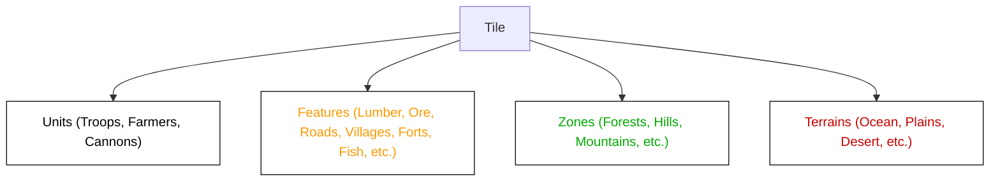
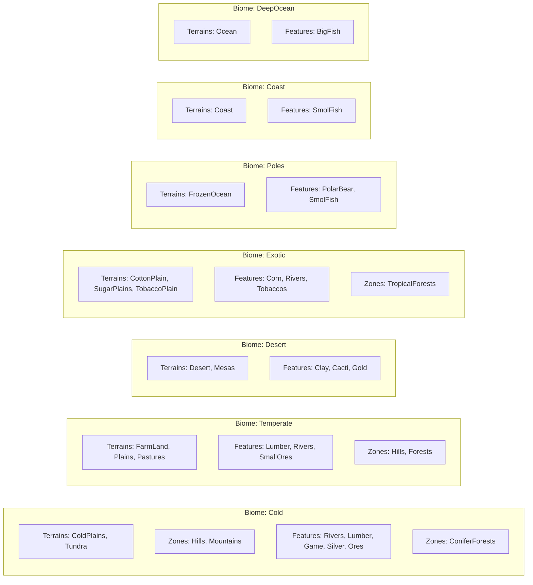

# Tiles - Structure et Biomes

## Structure d'une Tile

```mermaid
graph TD
    Tile --> Units["Units (Troops, Farmers, Cannons)"]
    Tile --> Features["Features (Lumber, Ore, Roads, Villages, Forts, Fish, etc.)"]
    Tile --> Zones["Zones (Forests, Hills, Mountains, etc.)"]
    Tile --> Terrains["Terrains (Ocean, Plains, Desert, etc.)"]

    style Units fill:#fff,stroke:#000,color:#000
    style Features fill:#fff,stroke:#000,color:#f90
    style Zones fill:#fff,stroke:#000,color:#0a0
    style Terrains fill:#fff,stroke:#000,color:#c00
```

> Les couches sont empilées (de bas en haut) : Terrains → Zones → Features → Units

---

## Biomes

```mermaid
graph LR
    subgraph Cold["Biome: Cold"]
        direction TB
        cold_terrains["Terrains: ColdPlains, Tundra"]
        cold_zones["Zones: Hills, Mountains"]
        cold_features["Features: Rivers, Lumber, Game, Silver, Ores"]
        cold_forests["Zones: ConiferForests"]
    end

    subgraph Temperate["Biome: Temperate"]
        direction TB
        temp_terrains["Terrains: FarmLand, Plains, Pastures"]
        temp_features["Features: Lumber, Rivers, SmallOres"]
        temp_zones["Zones: Hills, Forests"]
    end

    subgraph Desert["Biome: Desert"]
        direction TB
        des_terrains["Terrains: Desert, Mesas"]
        des_features["Features: Clay, Cacti, Gold"]
    end

    subgraph Exotic["Biome: Exotic"]
        direction TB
        exo_terrains["Terrains: CottonPlain, SugarPlains, TobaccoPlain"]
        exo_features["Features: Corn, Rivers, Tobaccos"]
        exo_zones["Zones: TropicalForests"]
    end

    subgraph Poles["Biome: Poles"]
        direction TB
        pol_terrains["Terrains: FrozenOcean"]
        pol_features["Features: PolarBear, SmolFish"]
    end

    subgraph Coast["Biome: Coast"]
        direction TB
        coa_terrains["Terrains: Coast"]
        coa_features["Features: SmolFish"]
    end

    subgraph DeepOcean["Biome: DeepOcean"]
        direction TB
        deep_terrains["Terrains: Ocean"]
        deep_features["Features: BigFish"]
    end
```
